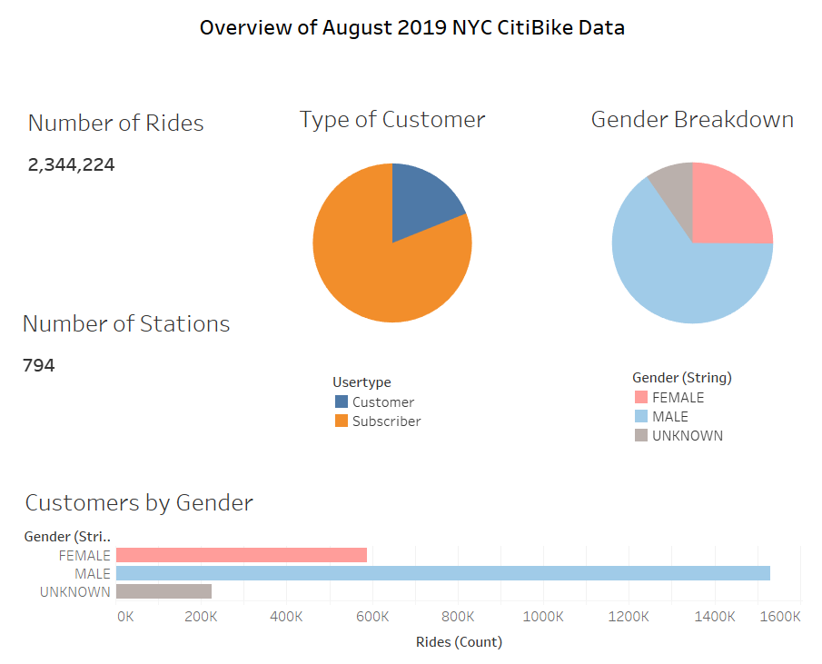
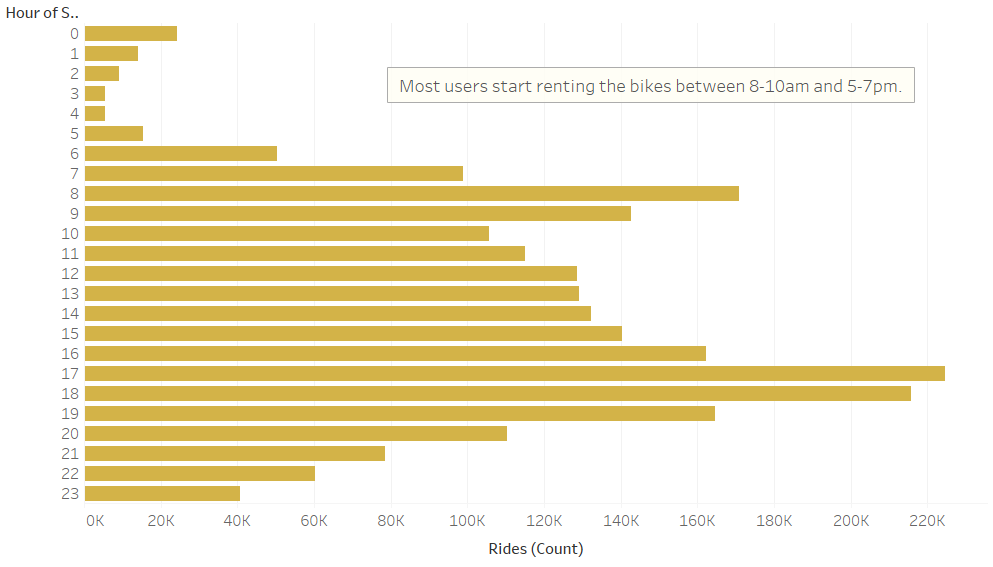
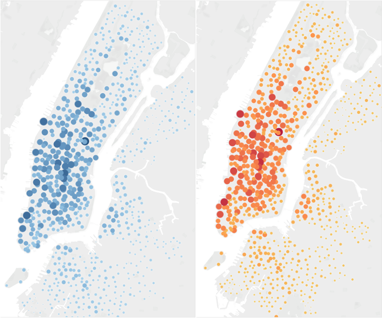
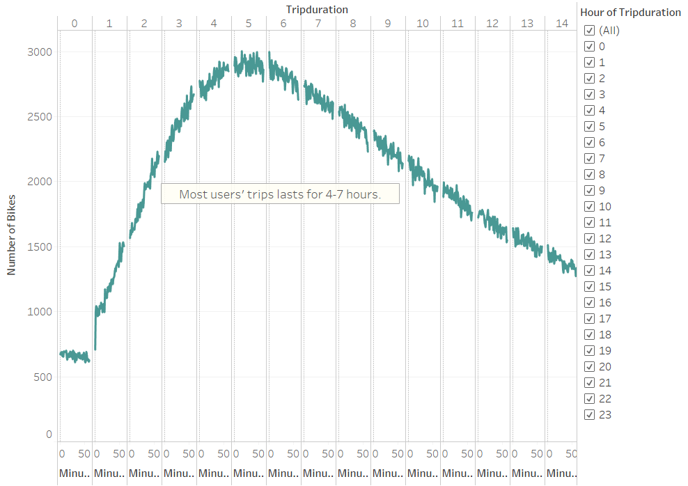
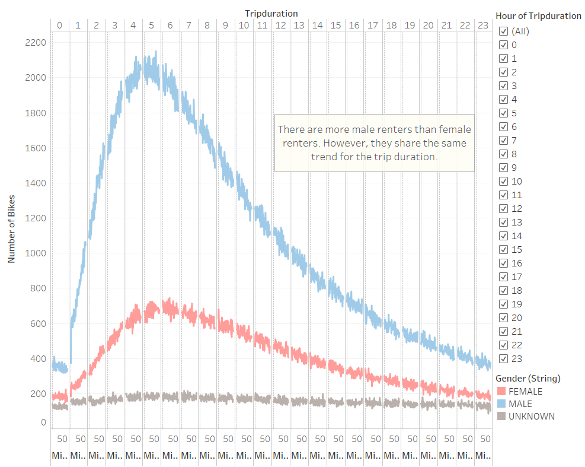
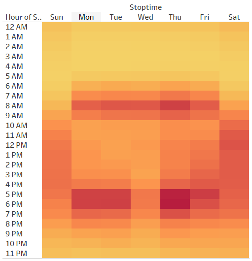
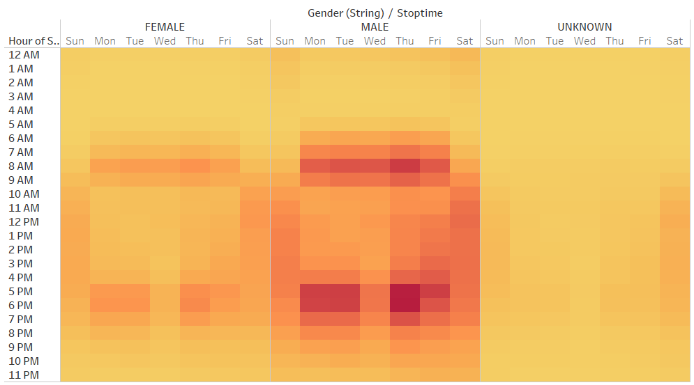
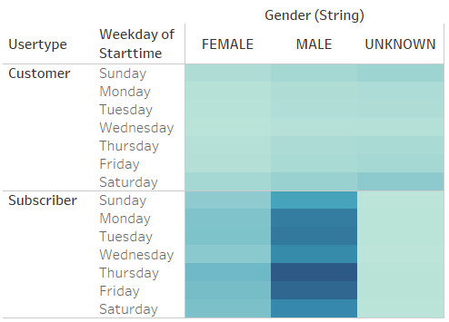

# NYC CitiBike Analysis

## Overview
After a trip to New York City with my friend, Kate, we noticed that part of what made our trip so great was our use of CitiBike, a bike-share program. This got me wondering if we could start a similar ride-share business in my hometown, Des Moines, Iowa. Making this business work might be quite different in Des Moines than in New York City. So, we gathered information on the bike-share business in New York City and conducted an analysis to better understand how it works. Then, we created a proposal on how it might work in Des Moines. The purpose of this analysis is to help the potential investors determine whether they should invest in a bike-sharing program in Des Moines.

## Results
#### The link to the NYC CitiBike Tableau dashboard can be found [here](https://public.tableau.com/profile/amelin.norzamini#!/vizhome/Module14-NYCCitiBikeChallenge/NYCCitiBike "NYC CitiBike Dashboard"). 

### The Overview of the August 2019 NYC CitiBike Data

This page shows an overview of the dataset to introduce some of the categories that will be explored in this analysis. Below are some of the key points:

- This Citi Bike Trip Histories dataset was obtained from the [citibike System Data](https://www.citibikenyc.com/system-data "Citi Bike Trip Histories") site. We chose to only look at data in August of 2019 because there is likely more traffic during the summer months.
- The total number of rides is 2,344,224.
- There was a total of 794 bike rental stations.
- There were two types of customers recorded (customer and subscriber).
- The gender can be broken down into three categories (male, female, and unknown).

### August Peak Hours

According to this graph, we can see that most users rent the bikes between 8-10am and 5-7pm. This is likely due to possible work day commute hours. 

### Top Starting & Ending Locations

The graph above shows the top starting (blue) and ending locations(red-gold). The size of the coloured dot represents how many rides were taken. The dot gets bigger and darker when there are more rides. The top starting and top ending locations are likely the similar as they are located in areas with more tourists and higher foot traffic.

### Checkout Times for Users

This graph shows the trip duration for each bike rental with the hours located at the top of the x-axis and minutes at the bottom of the x-axis. Most users' trips last between 4-7 hours, with the 5 hour mark being the most common. 

### Checkout Times by Gender

Similar to the previous graph, this graph includes the breakdown of the users' genders. The blue line represents males, the pink represents females, and the grey represents the unknown category. All three categories have similar trend lines with males having the highest number of rides compared to females and the unknown category.

### Trips by Weekday for Each Hour

This graph shows the number of trips taken each hour by weekday. The colours represent the number of rides taken. The darker the colour, the more trips taken. As we can see in the graph above, there are more trips taken around 8am and between 5-7pm during Monday through Friday. Bike trips are taken most often on Thursdays between 5-7pm.

### Trips by Gender (Weekday per Hour)

This graph shows the number of trips taken each hour by weekday broken down by gender. Similar to what was observed in the previous graph, trips are mostly taken around 8am and between 5-7pm during Monday through Friday for males and females. The unknown gender category has more rides on Saturdays and Sundays between 8am-8pm compared to the other days.

### User Trips by Gender by Weekday

This graph shows the number of trips taken by weekday and broken down by user type and gender. There are two user types, "customer" and "subscriber". A customer is a user with a 24-hour or 3-day pass, while a subscriber is a user with an annual subscription. At a glace, we can see that male subscribers have the most trips, followed by female subscribers, and then the unknown gender subscribers. From this graph, we are also able to see that customers in the unknown gender category have more trips compared to male and female customers.

## Summary
Overall bike rentals are male dominated. In general, peak usage is during commute times to and from work. 

1. Bar chart to see customers vs subscribers.
